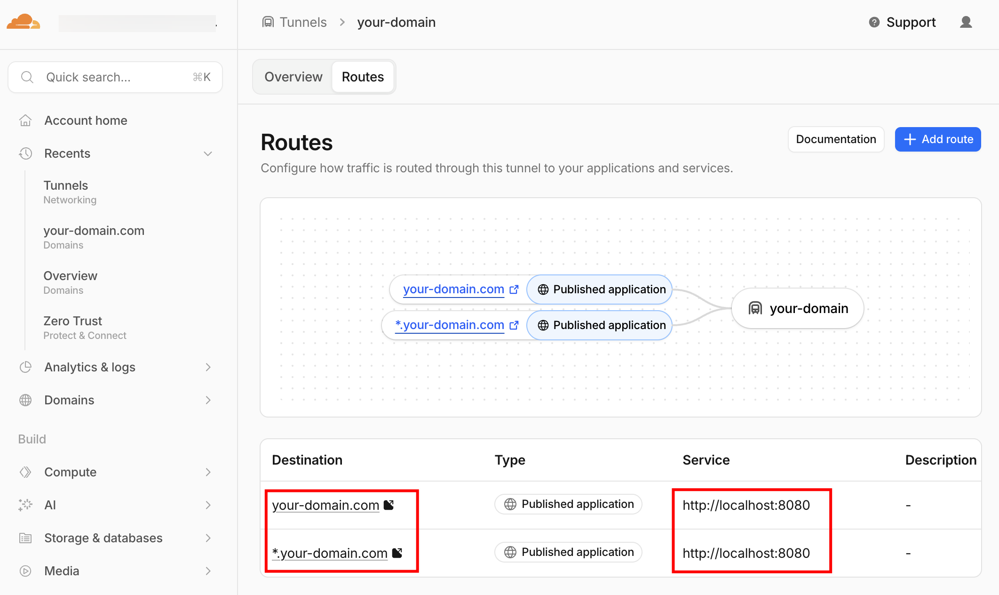

# 🌐 Flux Gate

基于 Cloudflare Tunnel 的内网穿透代理服务器，提供 Web 管理界面和动态子域名路由功能。

管理界面示例：


## 功能与背景

### 为什么需要这个？

在本地开发或家庭网络环境中，很多服务运行在内网 IP 上，无法从外网直接访问。传统的解决方案（如 frp、ngrok）需要客户端软件和服务器配置，而 Cloudflare Tunnel 提供了一种更简单的方式：

- **无需公网 IP**：通过 Cloudflare 的全球网络访问
- **自动 HTTPS**：Cloudflare 提供免费的 SSL/TLS 证书
- **高可用性**：Cloudflare 的全球 CDN 网络
- **安全性**：统一的 Basic Auth 认证

### 核心功能

1. **动态子域名路由**：通过 Web 界面实时添加/删除路由，无需重启服务
2. **统一认证**：一套账号密码保护所有子域名和管理界面
3. **WebSocket 支持**：完美支持实时应用（如 WebSocket、Socket.io）
4. **零配置启动**：首次运行自动创建默认配置
5. **配置文件管理**：所有配置通过单个 JSON 文件管理，易于备份和迁移

### 使用场景

- **开发环境**：将本地开发服务器暴露给团队或客户预览
- **家庭服务**：从外网访问家庭 NAS、摄像头、媒体服务器等
- **内网穿透**：访问公司内网服务，无需 VPN
- **临时分享**：快速分享本地资源给远程同事

## ⚠️ 安全提醒

### 重要安全提示

**本工具会通过公网暴露你的内网服务，任何知道域名和密码的人都可以访问。**

请务必注意以下安全事项：

1. **立即修改默认密码**：默认账号 `admin/admin`，首次部署后必须立即修改
2. **使用强密码**：密码长度至少 12 位，包含大小写字母、数字和特殊字符
3. **仅暴露必要服务**：不要暴露数据库、文件系统等敏感服务
4. **定期更换密码**：建议每 3-6 个月更换一次密码
5. **监控访问日志**：定期检查 PM2 日志，发现异常访问及时处理
6. **配置 Cloudflare 安全**：在 Cloudflare 面板配置防火墙规则，限制访问来源

### 推荐安全实践

- 使用环境变量或密钥管理工具存储密码（不要提交到 Git）
- 为不同服务配置不同的子域名和访问控制
- 启用 Cloudflare 的 WAF 规则，阻止恶意请求
- 定期备份配置文件和密码哈希
- 不要在公共场所使用管理界面，避免密码泄露

### Cloudflare 安全配置建议

1. **启用防火墙规则**：在 Cloudflare Dashboard → Security → WAF 中配置：
   - 限制访问频率（Rate Limiting）
   - 阻止已知的恶意 IP（IP Access Rules）
   - 启用 Bot Fight Mode

2. **配置访问地理限制**：如果只需要特定地区访问，配置地理位置过滤

3. **启用 2FA**：为 Cloudflare 账号启用双重认证

## 快速开始

### 前置要求

- Node.js 14+
- Cloudflare 账号
- 已拥有域名（需添加到 Cloudflare）

### 首次部署

#### 1. 准备项目

```bash
# 克隆项目
git clone <repository-url>
cd flux-gate

# 安装依赖
npm install

# 创建配置文件
cp config.sample.json config.json

# 编辑配置文件（修改域名、端口、路由等）
vim config.json
```

#### 2. 配置 Cloudflare Tunnel

```bash
# Cloudflare Tunnel 认证
cloudflared tunnel login

# 创建命名隧道（替换为你的隧道名称）
cloudflared tunnel create my-tunnel

# 配置 DNS 通配符
cloudflared tunnel route dns my-tunnel "*.your-domain.com"
cloudflared tunnel route dns my-tunnel your-domain.com
```

### 启动方式

#### 方式一：直接启动（适合临时使用）

```bash
# 终端 1：启动代理服务
npm start

# 终端 2：启动 Cloudflare Tunnel
cloudflared tunnel run my-tunnel
```

#### 方式二：使用 PM2 进程管理（推荐生产环境）

```bash
# 启动代理服务
pm2 start src/server.js --name flux-gate

# 启动 Cloudflare Tunnel
pm2 start cloudflared --name cloudflare-tunnel -- tunnel run my-tunnel

# 保存进程列表（重启后自动恢复）
pm2 save
```

### Cloudflare Tunnel 配置效果图

Cloudflare Tunnel 配置后的效果如图：



## 配置说明

### config.json

```json
{
  "port": 8080,
  "baseDomain": "your-domain.com",
  "auth": {
    "username": "admin",
    "password_hash": "sha256..."
  },
  "routes": [
    {
      "subdomain": "demo",
      "ip": "192.168.1.100",
      "port": "3000",
      "description": "示例服务"
    }
  ]
}
```

| 字段 | 必填 | 说明 |
|------|------|------|
| `port` | ❌ | 代理服务监听端口（默认: 8080） |
| `baseDomain` | ❌ | 基础域名（默认: localhost） |
| `auth` | ✅ | 认证配置对象 |
| `auth.username` | ✅ | 用户名 |
| `auth.password_hash` | ✅ | 密码 SHA256 哈希值（空字符串首次启动自动生成 `admin/admin`） |
| `routes` | ✅ | 路由配置数组 |
| `subdomain` | ✅ | 子域名（如 `demo` 对应 `demo.your-domain.com`） |
| `ip` | ✅ | 目标服务 IP 地址 |
| `port` | ✅ | 目标服务端口 |
| `description` | ❌ | 服务说明 |

## 默认账号

- 用户名：`admin`
- 密码：`admin`

**⚠️ 首次部署后请务必修改密码！**

## 访问方式

### 主域名（管理界面）

```
https://your-domain.com
```

浏览器会弹出 Basic Auth 对话框，输入账号密码后进入管理界面。

### 子域名（路由服务）

```
https://demo.your-domain.com
```

访问配置的子域名，自动代理到内网服务。

## 管理命令

### 直接启动方式

```bash
# Ctrl+C 停止服务
# 需要手动重新启动
```

### PM2 管理方式

```bash
# 代理服务
pm2 start flux-gate      # 启动
pm2 stop flux-gate       # 停止
pm2 restart flux-gate    # 重启
pm2 logs flux-gate       # 查看日志

# Cloudflare Tunnel
pm2 start cloudflare-tunnel       # 启动
pm2 stop cloudflare-tunnel        # 停止
pm2 restart cloudflare-tunnel     # 重启
pm2 logs cloudflare-tunnel       # 查看日志

# 查看所有进程
pm2 status

# 删除进程
pm2 delete flux-gate
pm2 delete cloudflare-tunnel
```

## 常见问题

### 如何修改端口？

编辑 `config.json`，修改 `port` 字段，然后重启服务：

```bash
vim config.json
pm2 restart flux-gate
```

### 如何生成密码哈希？

```bash
node -e "console.log(require('crypto').createHash('sha256').update('你的密码').digest('hex'))"
```

### 如何添加新路由？

1. 访问 `https://your-domain.com`（管理界面）
2. 在表单中填写子域名、IP、端口
3. 点击"添加"按钮，立即生效（无需重启）

### 为什么子域名访问 404？

检查以下几点：
1. Cloudflare DNS 是否配置了通配符 `*.your-domain.com`
2. `config.json` 中是否配置了对应的子域名
3. 目标服务是否正常运行并可访问

### 如何查看日志？

```bash
# PM2 方式
pm2 logs flux-gate --lines 100
pm2 logs cloudflare-tunnel --lines 100

# 直接启动方式
# 日志直接显示在终端
```

### PM2 进程丢失怎么办？

```bash
# 重启 PM2 守护进程
pm2 resurrect

# 或重新启动服务
pm2 start src/server.js --name flux-gate
pm2 start cloudflared --name cloudflare-tunnel -- tunnel run my-tunnel
pm2 save
```

## 架构

```
用户请求
  ↓
Cloudflare Tunnel (cloudflared)
  ↓  (Cloudflare DNS: *.your-domain.com → Tunnel)
本地 :8080  flux-gate (Express)
  ↓  (根据 Host header 子域名查路由)
  ├─ your-domain.com        → 管理界面（Basic Auth）
  └─ xxx.your-domain.com   → http://<配置的IP>:<配置的端口>（Basic Auth）
```

## 项目结构

```
flux-gate/
├── src/
│   ├── server.js              # Express 主服务
│   ├── index.ejs              # 管理首页
│   └── settings.ejs           # 设置页（改密码）
├── assets/
│   └── cloudflare.png         # 配置效果图
├── config.sample.json         # 配置示例（复制为 config.json 使用）
├── package.json
├── README.md
└── .gitignore
```

## 依赖

- Node.js 14+
- Express
- http-proxy
- EJS
- Cloudflare Tunnel
- PM2（可选，用于进程管理）

## License

MIT
