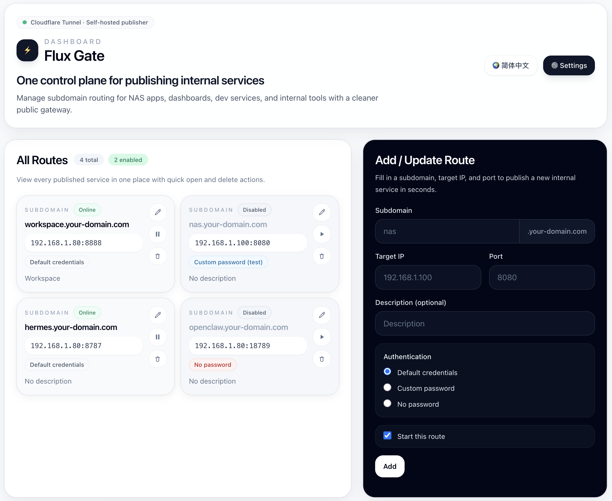

# 🌐 Flux Gate

[English](README.md) | **简体中文**

一个轻量级自建网关，用来通过 Cloudflare Tunnel 把内网服务发布到公网，并提供简单的 Web 管理界面和基于子域名的路由能力。



## 它能做什么

Flux Gate 可以帮你：
- 通过 Cloudflare Tunnel 暴露内网 Web 服务
- 用不同子域名转发到不同服务
- 通过 Web 界面管理路由
- 用默认账号密码保护管理后台和转发服务，并支持为单个转发项单独覆盖
- 支持给每个转发项单独设置用户名和密码或无密码
- 支持暂停和启用每个转发项目
- 支持管理面板中英文切换

示例：
- `https://your-domain.com` → 管理后台
- `https://demo.your-domain.com` → 你的内网服务

## 快速开始

### 1. 安装依赖

```bash
npm install
```

### 2. 创建配置文件

```bash
cp config.sample.json config.json
```

### 3. 编辑配置

```json
{
  "port": 8080,
  "baseDomain": "your-domain.com",
  "auth": {
    "username": "admin",
    "password_hash": ""
  },
  "routes": [
    {
      "subdomain": "demo",
      "ip": "192.168.1.100",
      "port": "3000",
      "description": "Demo service",
      "username": "",
      "password_hash": "",
      "no_password": false,
      "disabled": false
    }
  ]
}
```

字段说明：
- `port`：管理后台端口
- `baseDomain`：Cloudflare 管理的主域名
- `auth.username`：登录用户名
- `auth.password_hash`：密码的 SHA256 哈希；留空时首次启动默认 `admin/admin`
- `routes`：子域名转发规则列表
- `routes[].username`：可选，单个转发项自己的用户名；不填则使用默认管理账号
- `routes[].password_hash`：可选，单个转发项自己的密码哈希；不填则使用默认管理密码
- `routes[].no_password`：为 `true` 时，这个子网站不需要 Basic Auth
- `routes[].disabled`：为 `true` 时，这个转发项会保留在配置中，但不再提供访问

生成密码哈希：

```bash
node -e "console.log(require('crypto').createHash('sha256').update('你的密码').digest('hex'))"
```

### 4. 准备 Cloudflare Tunnel

```bash
cloudflared tunnel login
cloudflared tunnel create my-tunnel
cloudflared tunnel route dns my-tunnel your-domain.com
cloudflared tunnel route dns my-tunnel "*.your-domain.com"
```

### 5. 启动服务

终端 1：

```bash
npm start
```

终端 2：

```bash
cloudflared tunnel run my-tunnel
```

## 用 PM2 运行

```bash
pm2 start src/server.js --name flux-gate
pm2 start cloudflared --name cloudflare-tunnel -- tunnel run my-tunnel
pm2 save
```

## 默认账号

- 用户名：`admin`
- 密码：`admin`

首次部署后请立即修改。

## 安全提醒

Flux Gate 会把内网服务发布到公网。

请不要暴露这些内容：
- 数据库
- 缺少额外保护的管理后台
- 文件系统或私有面板
- 含敏感数据的服务（除非已做好安全防护）

请使用强密码，只发布真正需要对外访问的服务。

## 常见问题

### 子域名访问不了怎么办？
先检查这几个地方：
1. `cloudflared` 是否已启动
2. 是否配置了通配符 DNS：`*.your-domain.com`
3. 目标 IP 和端口是否正确
4. 目标服务是否真的在运行

### 怎么添加新路由？
打开管理后台，填写子域名 / IP / 端口并保存即可。你也可以为单个转发项设置独立用户名密码、开启无密码访问，或者直接停用该转发项。所有修改都会写入 `config.json` 并立即生效。

## License

ISC
